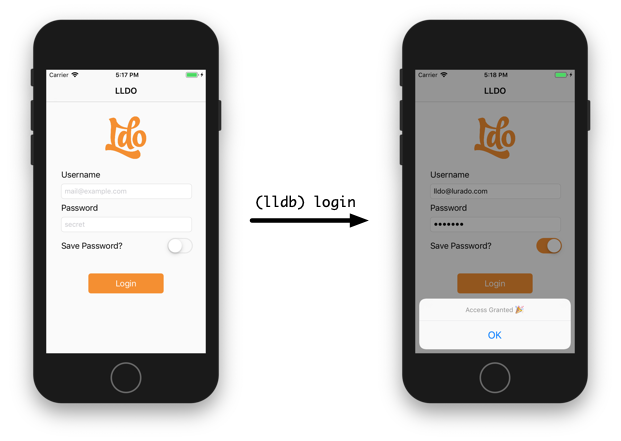
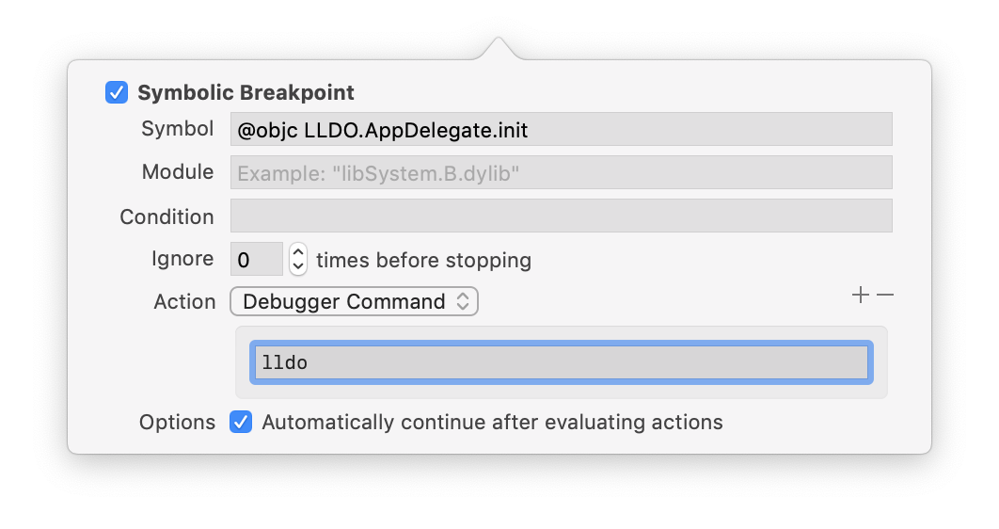
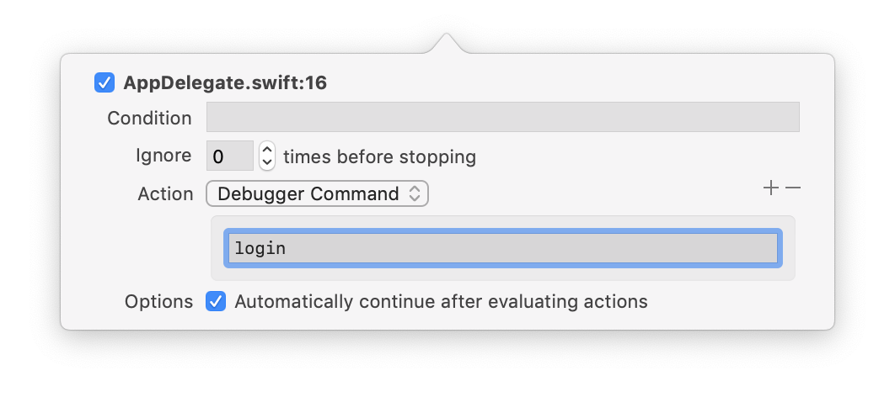

# LLDO - LLDB Automation with Swift

Write debugging helpers in Swift, combine them into powerful automation actions and run them as LLDB commands.


## Example



Let's say your app starts with a login form.
How often do you fill out that form every day?
Wouldn't it be nice to automate this? 
That's what LLDO is for. 


Simply write some automation steps in a `login.swift` file

```swift
UIView.find(byAccessibilityID: "username_input")?.enterText("lldo@lurado.com")
UIView.find(byAccessibilityID: "password_input")?.enterText("awesome")
UISwitch.first()?.slide()
UIButton.first()?.tap()
```

and call the combined action from LLDB: `(lldb) login`.


### Try It

1. Clone this repo
1. Open `Example/LLDOSwiftHelper.xcodeproj`
1. Run in the Simulator and wait to hit the breakpoint in `AppDelegate.applicationDidBecomeActive`.
1. Type the following commands in the LLDB prompt:
  - `command script import /path/to/LLDO` (make the LLDO commands available in LLDB)
  - `lldo ../lldo_actions` (load LLDO helpers and automation actions)
  - `login` (call `login` action)

Of course, this works for all kinds of forms. Every workflow that brings your app into a desired state can be automated.


## Helpers

LLDO comes with a bunch of helper methods that make writing common automation actions very easy.
If you're using the example app, you can try out a few of them:

```swift
// Poking around
po UIButton.first()
po UIView.current.all(UILabel.self)
po UIView.grep("Pass")
po UIView.find(byAccessibilityID: "username_input")
po UIView.current.tree().filter { $0.isHidden }

// Changing stuff
po UITextField.first()?.enterText("mail@company.com")
po UISwitch.first()?.slide()
po UIButton.first()?.tap()
```

Check the documentation at [lurado.github.io/LLDO](https://lurado.github.io/LLDO) for a complete list.

### Custom Helpers

Helpers need to be extensions on existing classes (see `(lldb) help load_swift_file` for details).
You can develop them like any other code in a Xcode project. 

1. Run an application and pause it to start LLDB
1. Use the `load_swift_file` command to load the file
1. Call your helpers
1. Adjust the implementation
1. GOTO 1 (unfortunately loading a files twice in a LLDB session results in duplicate symbols)

⚠️ Do **NOT** add these files to your target!
Helpers commonly contain code that you would never write in your production app.
For debugging it's fine though.


## Automation Actions

LLDO actions are simple Swift files that contain a series of commands.
Each file corresponds to an action of the same name, for example [`login.swift`](Example/lldo_actions/login.swift) will be turned into a `login` action.

To load all actions in a folder, use the `lldo` or `load_lldo_actions` commands. 
By default these commands look for a `lldo_actions` folder, located next to the source file of the current breakpoint.

⚠️ Again, do **NOT** add these files to your target either! 
They are for debugging purpose only and should not be shipped with your app.


## Setup and Usage

To not have to manually import the path to LLDO in every LLDB session, add the following line to your `~/.lldbinit`:

```
command script import /path/to/LLDO
```

This always loads LLDO's LLDB commands and makes them available in every project.

You can use breakpoints to further automate the initialization.
For example a symbolic breakpoint in `@objc <module>.<AppDelegate>.init` (e.g. `@objc LLDO.AppDelegate.init`) can be used to load LLDO.



This would also load all actions in a `lldo_actions` folder next to your Xcode project/workspace file.

Likewise breakpoints can be used to trigger actions. 
For instance a breakpoint in `applicationDidBecomeActive` can be used to call the `login` action in the example app.



It's important to check "Automatically continue" for those breakpoints. 
Otherwise you would have to press "Continue" every time the breakpoints are hit.

If your whole team uses LLDO, you can share common breakpoints by right clicking them and selecting "Share Breakpoint".


### Pure Objective-C Projects On a Device

To be able to use the Swift helpers (and thus LLDO) in an Objective-C project on an iOS device, you need to bundle the necessary Swift runtime libraries:

1. Add a single Swift file
1. Do **not** create a bridging header
1. make sure you `import UIKit`

If you are curious why this is necessary, see `(lldb) help load_swift_runtime` for details.


## Credits

This project has been heavily inspired by [@kastiglione](https://twitter.com/kastiglione). You should check out his [talk](https://www.youtube.com/watch?v=9Io2_W1iDLQ).

## LICENSE

MIT - see [LICENSE](LICENSE) file.

